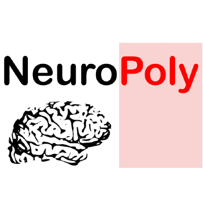
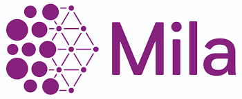
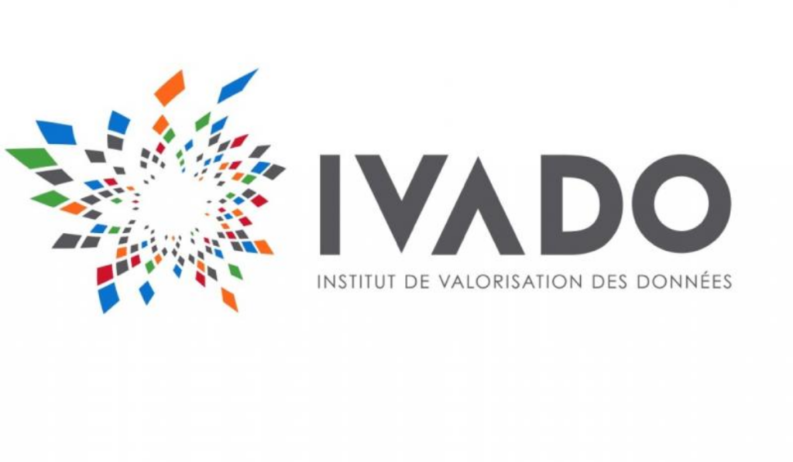

ivadomed
========

.. note:: This website is under construction.

``ivadomed`` is an integrated framework for medical image analysis with deep
learning. The name is a portmanteau between *IVADO* (The `Institute for data
valorization <https://ivado.ca/en/>`_) and *Medical*.

The purpose of the ``ivadomed`` project is to:

- Provide researchers with an open-source framework for training deep learning models for applications in medical imaging;

- Provide ready-to-use :doc:`models` trained on multi-center data.

.. toctree::
   :maxdepth: 1
   :caption: Overview

   comparison_other_projects.md
   technical_features.md

.. toctree::
   :maxdepth: 1
   :caption: Getting started

   installation.md
   getting_started.md
   tutorials.md
   data.md
   models.rst

.. toctree::
   :maxdepth: 1
   :caption: Developer section

   contributing.md
   api_ref.rst

Contributors
------------

This project results from a collaboration between the
`NeuroPoly Lab <https://www.neuro.polymtl.ca>`_ and `Mila <https://mila.quebec/en/>`_.

A list of contributors is available `here <https://github.com/neuropoly/ivado-medical-imaging/graphs/contributors>`_.

Sponsors
--------

If you wish to sponsor this project, please consider `donating <https://github.com/sponsors/neuropoly>`_.

License
-------

.. include:: ../../LICENSE.md
