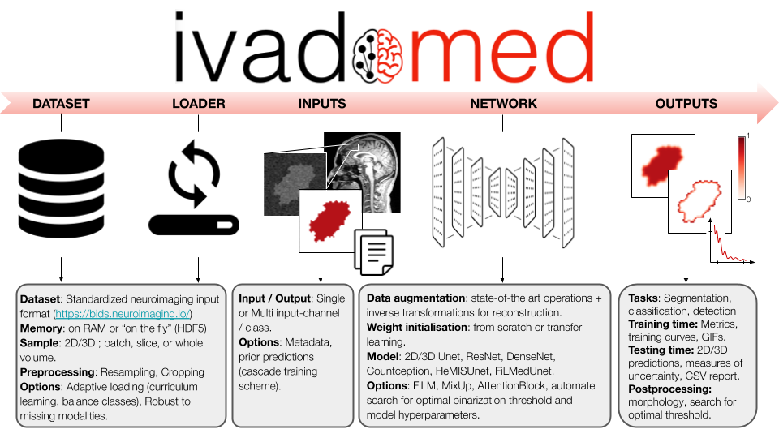

|

``ivadomed`` is an integrated framework for medical image analysis with deep
learning. The name is a portmanteau between *IVADO* (The `Institute for data
valorization <https://ivado.ca/en/>`_) and *Medical*.

If you use ``ivadomed`` for your research, please cite:

.. code::

  @misc{gros2020ivadomed,
      title={ivadomed: A Medical Imaging Deep Learning Toolbox}, 
      author={Charley Gros and Andreanne Lemay and Olivier Vincent and Lucas Rouhier and Anthime Bucquet and Joseph Paul Cohen and Julien Cohen-Adad},
      year={2020},
      eprint={2010.09984},
      archivePrefix={arXiv},
      primaryClass={cs.CV}
  }

Home
====

.. toctree::
   :maxdepth: 1
   :caption: Overview

   purpose.rst
   technical_features.rst
   use_cases.rst

.. toctree::
   :maxdepth: 1
   :caption: Getting started

   installation.rst
   data.rst
   configuration_file.rst
   usage.rst
   architectures.rst
   pretrained_models.rst
   scripts.rst

.. _tutorials:
.. toctree::
   :maxdepth: 1
   :caption: Tutorials

   tutorials/one_class_segmentation_2d_unet.rst
   tutorials/cascaded_architecture.rst
   tutorials/uncertainty.rst

.. toctree::
   :maxdepth: 1
   :caption: Developer section

   contributing.rst
   api_ref.rst
   contributors.rst
   license.rst
