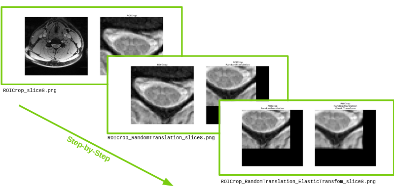
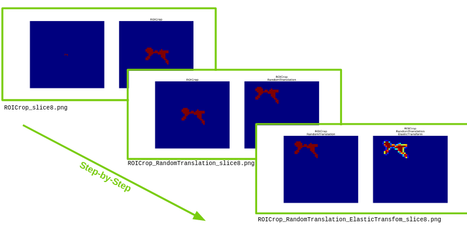

..  scripts:

Utility scripts
===============

Visualize data augmentation transformations
***********************************************
Data augmentation is a key part of the Deep Learning training scheme. This script aims at facilitating the fine-tuning of data augmentation parameters. To do so, this script provides a step-by-step visualization of the transformations that are applied on data.

The ``scripts/visualize_transforms.py`` script applies a series of transformations (defined in a configuration file ``-c``) to ``-n`` 2D slices randomly extracted from an input image (``-i``), and save as png the resulting sample after each transform.

For example::

    python scripts/visualize_transforms.py -i t2s.nii.gz -n 1 -c config.json -r t2s_seg.nii.gz

Provides a visualization of a series of three transformation on a randomly selected slice:

And on a binary mask::

    python scripts/visualize_transforms.py -i t2s_gmseg.nii.gz -n 1 -c config.json -r t2s_seg.nii.gz

Gives:

Convert a model from PyTorch to ONNX format
***********************************************
The integration of Deep Learning models into the clinical routine requires cpu optimized models. To export the PyTorch models to `ONNX <https://github.com/onnx/onnx>`_ format and to run the inference using `ONNX Runtime <https://github.com/microsoft/onnxruntime>`_ is a time and memory efficient way to answer this need.

``scripts/convert_to_onnx.py`` converts a model from PyTorch to ONNX format, with information of whether it is a 2D or 3D model (``-d``)::

    python scripts/convert_to_onnx.py -m path/to/model.pt -d 3

Model's hyper-parameters optimisation
***********************************************
Model's hyper-parameters optimisation is tedious and time-consuming. ``scripts/automate_training.py`` allows to automatize this optimisation on multiple GPUs. The scripts runs trainings, on the same training and validation datasets, by combinating a given set of parameters and set of values for each of these parameters. Results are collected for each combination and reported into a dataframe to allow their comparison. The script efficiently allocates each training to one of the available GPUs. ::

    python scripts/automate_training.py -c path/to/config.json

.. TODO: add example of DF

Compare models' performance at inference time
***********************************************
``scripts/compare_models.py`` compares the performance of models at inference time on a common testing dataset using paired t-tests. This scripts uses a dataframe generated by ``scripts/automate_training.py`` with the parameter ``--run-test`` (used to run the models on the testing dataset). ::

    python scripts/compare_models.py -df path/to/dataframe.csv --test-set

.. TODO: add example of DF
