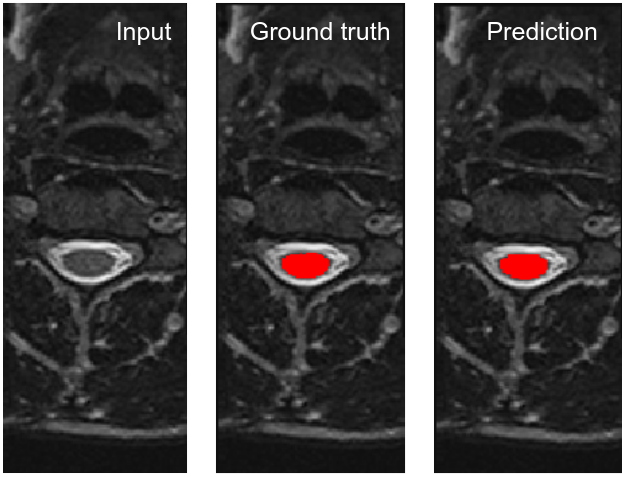

One-class segmentation with 2D U-Net
====================================

In this tutorial we will learn the following features:

- Training of a segmentation model (U-Net 2D) with a single label on multiple contrasts,

- Testing of a trained model and computation of 3D evaluation metrics.

- Visualization of the outputs of a trained model.

Download dataset
----------------

We will use a publicly-available dataset consisting of MRI data of the spinal cord. This dataset is a subset of the
`spine-generic multi-center dataset <https://github.com/spine-generic/data-multi-subject>`_ and has been pre-processed
to facilitate training/testing of a new model. Namely, for each subject, all six contrasts were co-registered together,
and semi-manual cord segmentation label was created. More details
`here <https://github.com/ivadomed/ivadomed/blob/master/dev/prepare_data/README.md>`_.

To download the dataset (~450MB), run the following commands in your terminal:

.. code-block:: bash

   curl -o ivadomed_spinegeneric_registered.zip -L https://github.com/ivadomed/data_spinegeneric_registered/releases/download/r20200907/data_spinegeneric_registered-r20200907.zip
   unzip ivadomed_spinegeneric_registered.zip

Create and fill your configuration file
---------------------------------------
Examples of configuration files are available in the ``ivadomed/config/`` folder and the parameter documentation is
available in :doc:`../configuration_file`.

We are highlighting here below some key parameters to perform a one-class 2D segmentation training. In this tutorial, we will use the configuration file: ``ivadomed/config/config.json``.

- To run a training, use the parameter ``"command"``::

    "command": "train"

- Indicate the location of your BIDS dataset with ``"bids_path"``. If you downloaded the sample dataset using the lines mentioned above, the `bids_path` should lead towards this folder, e.g. ``"../data_spinegeneric_registered-master"`` if you download the data in the ``ivadomed`` folder::

    "bids_path": "path/to/bids/dataset"

- List the target structure by indicating the suffix of its mask in the ``"derivatives/labels"`` folder. For a one-class segmentation with our example dataset::

    "target_suffix": ["_seg-manual"]

- Specify the contrast(s) of interest::

    "contrast_params": {
        "training_validation": ["T1w", "T2w", "T2star"],
        "testing": ["T1w", "T2w", "T2star"],
        "balance": {}
    }
- Indicate the 2D slice orientation::

    "slice_axis": "axial"

- To perform a multi-channel training (i.e. each sample has several channels, where each channel is an image contrast), then set ``"multichannel"`` to ``true``. Otherwise, only one image contrast is used per sample. Note: the multichannel approach requires the different image contrasts to be registered together. In this tutorial, only one channel will be used::

    "multichannel": false

Run the training
----------------
Once the configuration file is filled, you can run the training by launching::

    ivadomed path/to/config/file.json

The main parameters of the training scheme and model will be displayed in the  terminal, followed by the loss value
on training and validation sets at every epoch. To know more about the meaning of each parameter, go to
:doc:`../configuration_file`. The value of the loss should decrease during the training.

.. code-block:: console

    Creating log directory: spineGeneric
    Using GPU number 0

    Selected transformations for the training dataset:
	Resample: {'wspace': 0.75, 'hspace': 0.75, 'dspace': 1, 'preprocessing': True}
	CenterCrop: {'size': [128, 128], 'preprocessing': True}
	RandomAffine: {'degrees': 5, 'scale': [0.1, 0.1], 'translate': [0.03, 0.03], 'applied_to': ['im', 'gt']}
	ElasticTransform: {'alpha_range': [28.0, 30.0], 'sigma_range': [3.5, 4.5], 'p': 0.1, 'applied_to': ['im', 'gt']}
	NumpyToTensor: {}
	NormalizeInstance: {'applied_to': ['im']}

    Selected transformations for the validation dataset:
	Resample: {'wspace': 0.75, 'hspace': 0.75, 'dspace': 1, 'preprocessing': True}
	CenterCrop: {'size': [128, 128], 'preprocessing': True}
	NumpyToTensor: {}
	NormalizeInstance: {'applied_to': ['im']}

    Selected architecture: Unet, with the following parameters:
	dropout_rate: 0.3
	bn_momentum: 0.9
	depth: 4
	folder_name: seg_sc_t1_t2_t2s_mt
	in_channel: 1
	out_channel: 1
    Loading dataset: 100%|██████████████████████████████████████████████████████████████████████████████████████████████████████████████████████████████████████████████████████| 6/6 [00:00<00:00, 1854.79it/s]
    Loaded 93 axial slices for the validation set.
    Loading dataset: 100%|████████████████████████████████████████████████████████████████████████████████████████████████████████████████████████████████████████████████████| 18/18 [00:00<00:00, 1815.06it/s]
    Loaded 291 axial slices for the training set.
    Creating model directory: spineGeneric/seg_sc_t1_t2_t2s_mt

    Initialising model's weights from scratch.

    Scheduler parameters: {'base_lr': 1e-05, 'max_lr': 0.01}

    Selected Loss: DiceLoss
	with the parameters: []
    Epoch 1 training loss: -0.0420.                                                                                                                                                                             
    Epoch 1 validation loss: -0.0507.  

After 100 epochs (see ``"num_epochs"`` in the configuration file) on the provided spinal cord segmentation dataset, the dice score on the validation set should be ~90%. It is recommended to do the training on GPU, but if no GPUs are available, the training will be run on CPU.

Evaluate model performance on the testing sub-dataset
-----------------------------------------------------
In order to test the trained model on the testing sub-dataset and compute evaluation metrics, open your config file and set ``"command"`` to ``"eval"``::

    "command": "eval"

Then run::

    ivadomed path/to/config/file.json

The model's parameters will be displayed in the terminal, followed by a preview of the results for each image. The resulting segmentation is saved for each image in the `<log_directory>/pred_masks` while a csv file, saved in `log_directory/results/eval/evaluation_3Dmetrics.csv`, contains all the evaluation metrics (implemented in :mod:`ivadomed.metrics`).

.. code-block:: console

    Log directory already exists: spineGeneric
    Using GPU number 0

    Selected architecture: Unet, with the following parameters:
	dropout_rate: 0.3
	bn_momentum: 0.9
	depth: 4
	folder_name: seg_sc_t1_t2_t2s_mt
	in_channel: 1
	out_channel: 1

    Run Evaluation on spineGeneric/pred_masks

    Evaluation: 100%|█████████████████████████████████████████████████████████████████████████████████████████████████████████████████████████████████████████████████████████████| 5/5 [00:06<00:00,  1.33s/it]
                             avd_class0  dice_class0  lfdr_101-INFvox_class0  lfdr_class0          ...            specificity_class0  vol_gt_class0  vol_pred_class0  lfdr_21-100vox_class0
    image_id                                                                                       ...                                                                                     
    sub-strasbourg04_T2w       0.047510     0.921796                     0.0          0.0          ...                      0.999939         4920.0          4686.25                    NaN
    sub-hamburg01_T2w          0.013496     0.943535                     0.0          0.0          ...                      0.999934         5650.0          5573.75                    NaN
    sub-hamburg01_T1w          0.103540     0.902706                     0.0          0.0          ...                      0.999946         5650.0          5065.00                    NaN
    sub-strasbourg04_T2star    0.082561     0.917791                     0.0          0.0          ...                      0.999852         4315.0          4671.25                    NaN
    sub-strasbourg04_T1w       0.437246     0.697122                     0.5          0.5          ...                      0.999979         4920.0          2768.75                    NaN

    [5 rows x 16 columns]

The test image segmentations are store in ``"<log_directory>/pred_masks"`` and have the same name as the input image with the suffix `_pred`. To visualize the segmentation of a given subject, you can use any Nifti image viewer. For FSLeyes user, this command-line will open the input image with its segmentation overlayed::

    fsleyes path/to/input/image.nii.gz path/to/pred_masks/subject_id_contrast_pred.nii.gz -cm red -a 0.5

After the training for 100 epochs, the segmentations should be similar to the one presented in the following image. The output and ground truth segmentations of the spinal cord are presented in red (subject `sub-hamburg01` with contrast T2w):

