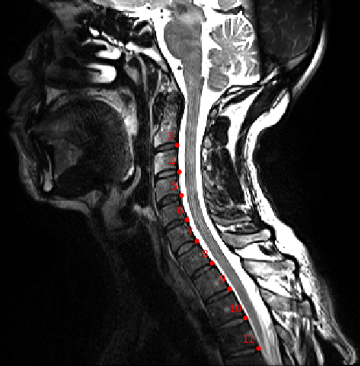

this script is made for manual labeling of sct_testing/large.
To run a script:
First give it permission: 
chmod 777 SCRIPT_NAME.sh
Run it with ./SCRIPT_NAME.sh TXT_FILE_WITH_SUB_NAME PATH_TO_DUKE SUFFIX_OF_FILE SUFFIX_OF_LABEL_FILE OUTPUT_FOLDER AUTHOR_NAME

- TXT_FILE_WITH_SUB_NAME: The txt file contain the list of subject you want to process which might not contain all the subject in sct_testing/large separated by '\n' (if you want all subject just use ls > file.txt)
- PATH_TO_DUKE:Use the absolut path as this is easier
- SUFFIX_OF_FILE: The suffix of the file you want to process (e.g. _T2w) might differ depending on subject. we recommend making a list according to suffix. 
- SUFFIX_OF_LABEL_FILE: The suffix of the label file is the same as the previous one (in the labels-disc-manual case) so it will open them with the -ilabel option from sct_label_utils 
- OUTPUT_FOLDER: in the output folder given by the 5th argument, you will find in BIDS convention sub-xxx/anat/sub-xxx_SUFFIX_OF_LABEL.nii.gz and sub-xxx/anat/sub-xxxSUFFIX_OF_LABEL.json
- AUTHOR_NAME: Author name that will appear on the .json file
 
All the subject treated will be saved in a file called list_done.txt that will allow you to keep track of progression and subject in output

Specific:
possible file suffix to file are _acq-sag_T2w, _T2w, _T1w, _acq-sagcerv_T2w
suffix to label is labels-disc-manual

Example image for manual labeling:

